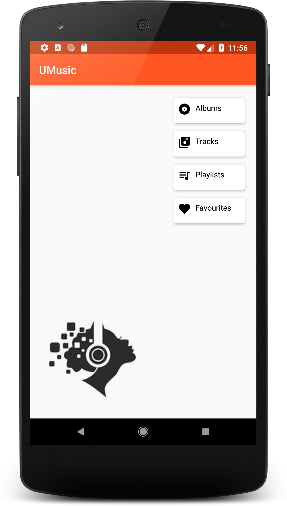
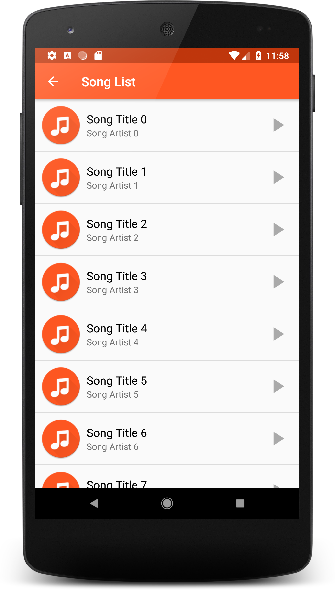

# Android Basics Nanodegree by Google | Udacity Project 4: Musical Structure App

An app structure suitable for a music player. You can read the requirements for this project [here](https://github.com/udacity/Project-Descriptions-for-Review/blob/master/Beginner%20Android/Musical_Structure.md). 

The app is not a funcional music player but rather has a "structure that is suitable to be a music player."

   
